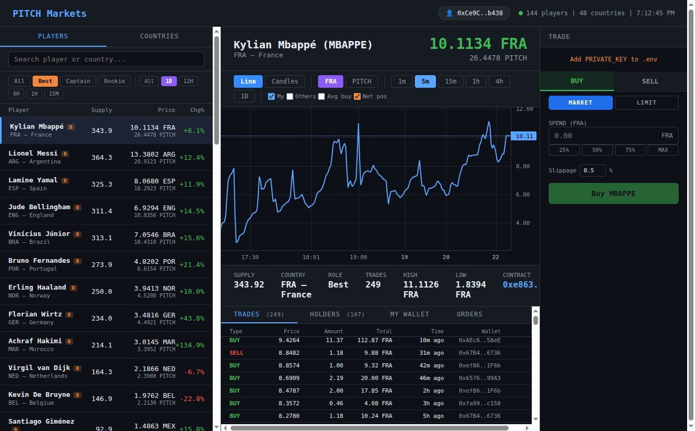

# PitchTerminal

A browser dashboard and trading terminal for [pitchwc.app](https://pitchwc.app) — the
player and country token markets on Base L2. Live charts, on-chain trading, automatic
limit orders, and a full wallet profile.



## ⚠️ Everything runs on your own computer

PitchTerminal is **fully local**. The Flask server, the limit-order watcher, your `.env`
and your private key all live and run **on your machine** — there is no hosted backend,
and nothing leaves your computer except your own RPC calls to the Base network.

A direct consequence: **limit orders only fire while your computer is running the
server.** Close the machine and the watcher stops — your orders are saved and resume on
the next start. See [How limit orders run](#how-limit-orders-run).

> **Roadmap — help with a ⭐.** If this project gets enough stars, I'll build a hosted
> version: a dedicated always-on server with wallet connection, so limit orders run
> **24/7**, independent of whether your own machine is on.

## Security

PitchTerminal needs your wallet's **private key** to trade. Before you run it:

- 🔑 The key is stored in `.env` as **plaintext** on your disk. `.env` is gitignored and
  never sent anywhere — but anyone with access to your machine can read it.
- 🪪 **Use a dedicated / burner wallet** — fund it with only what you intend to trade,
  not your main wallet.
- 🤖 Limit orders **execute real on-chain trades with real funds, automatically**, while
  the server runs. Start with small amounts; the Orders tab has an *Auto-execution*
  kill-switch to pause everything.
- 🔍 This is an unofficial, **unaudited** tool — read the code before trusting it with a key.
- 👀 Without `PRIVATE_KEY` the dashboard is fully usable **read-only** (charts, markets,
  any wallet's stats). A key is needed only to place trades.

## Features

- **Charts** — candlestick / line charts for all 144 player and 48 country tokens, with
  multiple timeframes, your-vs-others trade markers, and avg-entry price lines.
- **Market trading** — buy / sell player *and* country tokens on-chain (bonding curve
  via Uniswap V4 hooks): live quotes, slippage control, and a balance check before the
  transaction is sent. Players trade against their country token; countries against PITCH.
- **Limit orders** — set a target price and a server-side watcher auto-executes the
  trade when the price crosses it. Two kinds: **limit buy** and **take-profit**.
  - *Catch-up guard* — after a server downtime, a limit buy that would fill far below
    target is held for **review** (Execute / Cancel) instead of buying into a possible
    crash. During live operation a triggered order just executes.
  - Global *Auto-execution* kill-switch to pause / resume firing.
- **My Wallet** — per-token PnL for the `.env` wallet: realized / unrealized, break-even,
  fees paid, ownership %, holder rank.
- **Wallet profile** — portfolio-wide view: total value & PnL, ROI, open / closed
  positions, full trade history, statistics, allocation, on-chain balances, and a
  portfolio-value chart over time.
- **Real-time** — prices and trades stream to the UI over SSE; the chart updates live.

## Stack

- Backend — Python 3.10+ with Flask + web3.py
- Frontend — single-file vanilla JS + lightweight-charts v4
- Chain — Base L2 (chain ID 8453); all market data via on-chain calls

## Setup

```bash
python3 -m venv venv
source venv/bin/activate
pip install -r requirements.txt
cp .env.example .env   # then fill in the values
```

`.env` variables:

| Variable | Purpose |
|----------|---------|
| `RPC_URL` | Base RPC endpoint (the public `https://mainnet.base.org` works) |
| `WALLET_ADDRESS` | Wallet shown across the dashboard — trade markers, My Wallet, profile (read-only) |
| `PRIVATE_KEY` | **Required only for trading and limit orders.** Never leaves your machine. |

## Run

```bash
source venv/bin/activate
python3 server.py
# dashboard: http://localhost:5555
```

On the **first launch** the server scans Base event history to build its local cache —
give it a minute. Subsequent starts load the cache and only scan new blocks.

## Usage

Open **http://localhost:5555** — browse players and countries, click any token for its
chart, trade history, holders, and (if a wallet is set) your per-token PnL.

**Trading** requires `PRIVATE_KEY` in `.env`. In the trade panel:

- **Market** — buys / sells immediately at the current price.
- **Limit** — set a target price; the order is placed and fires later automatically.

### How limit orders run

The limit-order watcher lives **inside the server process** — it polls prices every
5 seconds and executes triggered orders on-chain itself.

- ✅ **Keep `python3 server.py` running** — that process is what watches and fires your
  orders.
- ✅ **The browser tab is optional** — it is only the UI. You can close it; orders are
  still monitored and executed by the server.
- ⏸ **If you stop the server**, orders are no longer watched. Pending orders are saved to
  `limit_orders.json` and resume being watched the next time the server starts.
- 🔌 The **Orders** tab has an *Auto-execution* toggle — a kill-switch to pause / resume
  firing without stopping the server.
- 🛡 **Catch-up guard for limit buys** — on the first check after the server starts, if a
  limit buy triggers with the price already more than 20%
  (`config.LIMIT_REVIEW_THRESHOLD_PCT`) below its target, it is *not* bought
  automatically: the server was down and the market may have changed (a rug, etc.). It
  moves to a **review** state and a popup asks you to Execute or Cancel. During live
  operation a triggered order just executes — that is the order doing its job.

### Wallet profile

The **wallet chip** in the top-right header (👤 with your address) opens the **wallet
profile** — a portfolio-wide view of the `.env` wallet that replaces the chart area:

- Summary (portfolio value, realized / unrealized PnL, ROI), open & closed positions,
  full trade history, statistics, allocation, on-chain balances, and a portfolio-value
  chart over time.
- Open orders are listed with Execute / Cancel actions.
- Click any position to jump to that token's chart; click the chip again (or any token)
  to close the profile.

The bottom **Orders** tab is scoped to the currently charted token; the profile is the
place to see every order across all tokens.

## Project structure

| File | Role |
|------|------|
| `server.py` | Flask backend — API, SSE, price / event loops, trade execution, limit-order watcher |
| `static/index.html` | Single-page frontend |
| `config.py` | Contract addresses, ABIs, env vars |
| `tokens.json` | 48 countries + 144 players (checksum addresses, roles) |
| `events_cache.json` | Local Buy/Sell event cache — gitignored, rebuilt on startup if missing |
| `limit_orders.json` | Persisted limit orders — gitignored, created on first order |

## Notes

- Limit orders are a local watcher — pitchwc has no on-chain order book.
- Both player and country tokens are tradable — players via the Player Router (paid in
  the country token), countries via the Country Router (paid in PITCH).
- No paid RPC required — gas price is bumped 1.5× to compensate for the public RPC.
- Unofficial tool — not affiliated with pitchwc.app.

## Support the creator

If PitchTerminal is useful to you, tips are welcome — they fund development, including
the hosted 24/7 version mentioned in the roadmap above:

**`0xCe9CC08696D475B660B75fE0C1aF584CfA76b438`** — Base (or any EVM network)

A ⭐ on the repo helps just as much. Thank you!
